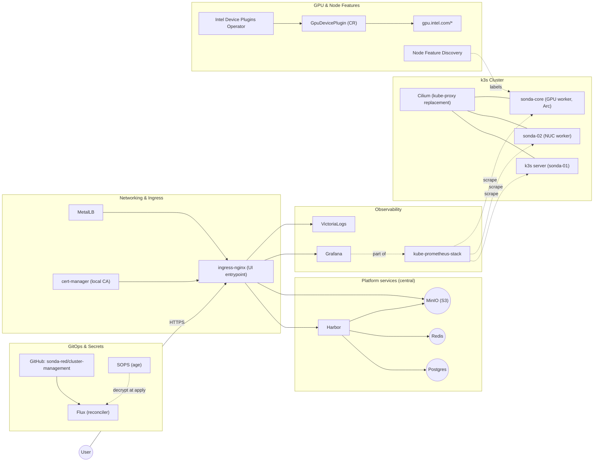

+++
authors = ["Kalin Daskalov"]
title = "Intel Lab Notes: Laying the Cluster Scaffold"
date = "2025-08-11"
description = "In the first part of this series, I walked through the hardware choices and the initial setup of my Intel-powered homelab. With the machines humming away, it was time to tackle the real challenge: building a Kubernetes cluster that’s not just functional, but maintainable and future-proof."
categories = ["intel lab notes"]
tags = ["k3s", "homelab", "storage", "architecture"]
+++


# Lab Notes: Bootstrapping k3s — my fast, imperfect path

In the first part of this series, I walked through the hardware choices and the initial setup of my Intel-powered homelab. With the machines humming away, it was time to tackle the real challenge: building a Kubernetes cluster that’s not just functional, but maintainable and future-proof.
---
> Some personal notes follow below, if you want to skip them, just scroll down to the next section with the table of contents to get to the detials of the setup.
## Philosophy: Get to Kubernetes fast and dirty, because I want to run some damned AI finally!

Not too dirty though...

In previous homelab builds I spent weeks on setting up complex home networks, PXE booting, HA experiments with external datastores, etc. An important lesson is that your project needs to have a priority and learning goal, otherwise you can get lost in making the most balanced, perfect, and future-proof setup. So forgive the ignored best practices of some aspects of this setup. The focus is of course running AI workloads on Intel Arc GPUs, I couldn't bring myself to just work on ephemeral `kind` clusters or something like that. So this is a mix of both worlds, not a perfect 3-master HA cluster and all the bells and whistles, but also not a single node cluster running locally.

### Flux and GitOps

My last post was about two months ago when I had the hardware ready and I was ready to start tinkering with it. It doesn't look like much progress but this is after hours with the kids, work, and other things. The fun and time consuming stuff was learning and utilizing `Flux`.

I've used `helmfile` with a pipeline setup in `Gitlab` for my previous homelab and use `ArgoCD` at work. Flux is a bit different but I like it for its pure GitOps approach. I'm a bit tired of clicking, to be honest. I don't want to click around in a UI, or follow pipelines along. I want to commit like a mad man and after a while have my changes propagated to the cluster. In theory, ArgoCD can do that too but there's something about the way you write the argo manifests that doesn't feel as clean as Flux. Don't treat this as a valid technical argument, it's just a personal preference. I also had a fun talk with a colleague once about the differences and this was his take:

> I've been working in 3 companies in a row, first one was using helmfile, second - argo, and third - flux
And in the first one we were just getting things done with k8s and having fun with other tasks, like we were working on a open source project, or trying compicated setups and different tools. But in the rest we were mostly trying to make GitOps work, re-writing manifests because of yaml typos, reviewing something like 700 lines of yaml code, merging, fixing, and trying to make GitOps work again. 

Hopefully this cluster won't grow to the extent that I have to deal with that :)

But yeah, the biggest time waster was following the logs of the flux helm controller, trying to figure out why it didn't apply the changes I made, redoing the changes, manually reconciling, etc. Dealing with all the different ways the helm charts of the tools organize their values and making me wonder why is still use them and not the raw manifests but giving into the temptation nonetheless. Also using the Flux configMap and secret generators and integrating them with SOPS was a bit of a pain. However when all the pieces fell into place and made a sound template, it was just a matter of replicating the same pattern for the rest of the cluster components.

## The constraint

I wanted Kubernetes up **now**, not after a month of yak‑shaving. I also wanted recent kernels for Intel Arc. That pushed me to **Fedora Server 42** on bare metal, manually installed on each box. No PXE, no golden images. Just `dnf upgrade` and go.

> Tradeoff I accepted: more hands‑on host maintenance early, less ceremony between me and a working cluster.

---

## Day 0: k3s no bs

I stripped k3s of the pieces I’d replace anyway — flannel, kube‑proxy, traefik. I love `cilium` because of its alien eBPF magic I don't quite understand, the visibility and the node firewall rules it gives me so that's the CNI, end of story.

This is literally what I ran on the first control‑plane:

```bash
curl -sfL https://get.k3s.io | sh -s - server \
  --token {token} \
  --cluster-init \
  --flannel-backend=none \
  --disable-kube-proxy \
  --disable servicelb \
  --disable-network-policy \
  --disable traefik \
  --tls-san=sondas \
  --tls-san=sonda-01 \
  --tls-san=sonda-02 \
  --tls-san=sonda-core \
  --tls-san=127.0.0.1 \
  --kube-apiserver-arg=kubelet-preferred-address-types=InternalIP,ExternalIP,Hostname
```

Workers joined with:

```bash
curl -sfL https://get.k3s.io | sh -s - agent \
  --token {token} \
  --server https://sonda-01:6443
```

I kept both the NUC and the GPU box as workers and only later differentiated them with taints.

---

## Storage layout

* **NUC nodes:** single 512 GB disk given entirely to k3s.
* **GPU node:** 2 TB NVMe for k3s data, 512 GB for the OS, and a separate 2 TB scratch disk for local experiments.

---

## Intel GPU support: the bare minimum

On the **GPU node only** I enabled Intel’s oneAPI repo and installed the base bits so containers would see Level Zero and friends. The operator doesn’t install drivers; hosts must be ready beforehand.

> Disclaimer: No automation here yet. I did this manually, but it’s a one‑time setup. I’ll automate it later.

repo file + packages:

```bash
sudo tee /etc/yum.repos.d/oneAPI.repo >/dev/null <<'EOF'
[oneAPI]
name=Intel oneAPI repository
baseurl=https://yum.repos.intel.com/oneapi
enabled=1
gpgcheck=1
repo_gpgcheck=1
gpgkey=https://yum.repos.intel.com/intel-gpg-keys/GPG-PUB-KEY-INTEL-SW-PRODUCTS.PUB
EOF
sudo dnf -y install intel-basekit intel-oneapi-runtime-libs
```

Sanity checks I  ran:

```bash
lsmod | grep -E 'i915|xe' || true
ls -l /dev/dri
```

Installing the `intel-basekit`, `intel-level-zero` and the `SYCL` packages will lead a system that supports the Intel Arc GPUs and the Level Zero API.

This support is later extended in kubernetes with the `intel-device-operator` and `intel-device-plugins-gpu` to expose the GPUs to the cluster, which you can follow in the next section.

---

## TLS: a local CA for now

I didn’t want public ACME in the lab. I minted a self‑signed root inside the cluster and used a CA `ClusterIssuer` for leaf certs. Trust is me installing the root CA on my devices, for the flex of having https on my ingress

Manifests were deployed at boostrapping the cluster: [bootstrap/cert-manager/kustomuzation/root-ca.yaml](https://github.com/sonda-red/cluster-management/tree/main/bootstrap/cert-manager/kustomization/root-ca.yaml).

## Secrets: SOPS, encrypted in Git

I keep secrets **in the repo** but encrypted with SOPS (age). Flux decrypts at apply time, so I get Git history without leaking credentials. Policy lives at the root: [.sops.yaml](https://github.com/sonda-red/cluster-management/blob/main/.sops.yaml). I encrypt per‑app secrets next to the app manifests.

Keys are off‑repo. The cluster only knows the age private key needed by Flux to decrypt.

---
## Architecture diagram

Below is the map I keep in my head. Central services (Postgres, Redis, MinIO) are shared by design; Harbor is just the first consumer but each later component requiring them will connect to them and not run it's separate service. **Ingress mainly fronts internal UIs** — Harbor, MinIO Console, Grafana, and VictoriaLogs.



## Component overview

Entry path for the reconciler: [clusters/sonda-red/](https://github.com/sonda-red/cluster-management/tree/main/clusters/sonda-red)
Reusable bits for Helm releases: [templates/flux/helm-release/](https://github.com/sonda-red/cluster-management/tree/main/templates/flux/helm-release)

### More or less self-explanatory infrastructure components:

* **Object storage:** MinIO → [infrastructure/minio/](https://github.com/sonda-red/cluster-management/tree/main/infrastructure/minio)
* **Registry:** Harbor (on Postgres + Redis) → [infrastructure/harbor/](https://github.com/sonda-red/cluster-management/tree/main/infrastructure/harbor)
* **Datastores:** Postgres → [infrastructure/postgres/](https://github.com/sonda-red/cluster-management/tree/main/infrastructure/postgres), Redis → [infrastructure/redis/](https://github.com/sonda-red/cluster-management/tree/main/infrastructure/redis)
* **Ingress:** ingress‑nginx → [infrastructure/ingress-nginx/](https://github.com/sonda-red/cluster-management/tree/main/infrastructure/ingress-nginx)
* **LB:** MetalLB → [infrastructure/metallb/](https://github.com/sonda-red/cluster-management/tree/main/infrastructure/metallb)
* **Metrics & dashboards:** kube‑prometheus‑stack → [infrastructure/kube-prometheus-stack/](https://github.com/sonda-red/cluster-management/tree/main/infrastructure/kube-prometheus-stack)
* **Logs:** VictoriaLogs → [infrastructure/victoria-logs/](https://github.com/sonda-red/cluster-management/tree/main/infrastructure/victoria-logs)
* **CI runners:** Actions Runner Controller → [infrastructure/arc/](https://github.com/sonda-red/cluster-management/tree/main/infrastructure/arc)

###### Central services

I chose **central** Postgres, **central** Redis, and **central** MinIO as cluster services. Today only Harbor consumes them, but they’re **for the whole cluster**. That keeps state small in number of places and easy to back up. Minio takes the largest chunk of storage from the 2 TB NVMe, as it's intended to be the S3 backend for most apps and I'll try to avoic persistent volumes when I can.

Harbor points to the shared services explicitly (values excerpt):

```diff
# harbor values
+ externalURL: https://harbor.sonda.red.local
+ database:
+   type: external
+   external:
+     host: postgres.postgres
+     username: harbor
+     coreDatabase: harbor
+ redis:
+   type: external
+   external:
+     addr: redis.redis:6379
```

Full manifests sit under [infrastructure/harbor/](https://github.com/sonda-red/cluster-management/tree/main/infrastructure/harbor). MinIO is the S3 backend Harbor writes to; other apps can use MinIO, Postgres, and Redis via their own DBs/buckets without spawning one‑off stacks.

### k3s specifics

* **Upgrades:** System Upgrade Controller → [flux-system/system-upgrade-controller.yaml](https://github.com/sonda-red/cluster-management/blob/main/clusters/sonda-red/flux-system/system-upgrade-controller.yaml)

 k3s has system upgrade controller, which is not built in but seperately installed. It consists of an operator and a controller that watches for `Plan` resources and applies them to the nodes. The nodes are adequately drained, cordoned and upgraded. I use it to upgrade the k3s version from within the cluster, so I can just change the version in the `Plan` and it will apply it to all nodes, without having to run k3s scripts on the nodes manually.

 An upgrade `Plan` looks like this:

```yaml
# Server plan
apiVersion: upgrade.cattle.io/v1
kind: Plan
metadata:
  name: server-plan
  namespace: system-upgrade
spec:
  concurrency: 1
  cordon: true
  nodeSelector:
    matchExpressions:
    - key: node-role.kubernetes.io/control-plane
      operator: In
      values:
      - "true"
  serviceAccountName: system-upgrade
  upgrade:
    image: rancher/k3s-upgrade
  version: v1.33.3-k3s1
  tolerations:
    - key: node-role.kubernetes.io/master
      operator: Exists
      effect: NoSchedule
    - key: node.kubernetes.io/unschedulable
      operator: Exists
      effect: NoSchedule
---
# Agent plan
apiVersion: upgrade.cattle.io/v1
kind: Plan
metadata:
  name: agent-plan
  namespace: system-upgrade
spec:
  concurrency: 1
  cordon: true
  nodeSelector:
    matchExpressions:
    - key: node-role.kubernetes.io/control-plane
      operator: DoesNotExist
  prepare:
    args:
    - prepare
    - server-plan
    image: rancher/k3s-upgrade
  serviceAccountName: system-upgrade
  upgrade:
    image: rancher/k3s-upgrade
  version: v1.33.3-k3s1
  tolerations:
    - key: dedicated
      operator: Equal
      value: gpu
      effect: PreferNoSchedule
    - key: node.kubernetes.io/unschedulable
      operator: Exists
      effect: NoSchedule
```


### Intel GPU specifics
* **Node inventory:** Node Feature Discovery → [infrastructure/nfd/](https://github.com/sonda-red/cluster-management/tree/main/infrastructure/nfd)
It detects the presence of Intel GPUs and labels them accordingly. GPU plugin’s node selector is used to deploy plugin to nodes which have such a GPU label.
* **Intel Device Operator:** Intel Device Operator → [infrastructure/intel-device-operator/](https://github.com/sonda-red/cluster-management/tree/main/infrastructure/intel-device-operator)
Intel Device Plugins Operator is a Kubernetes custom controller whose goal is to serve the installation and lifecycle management of Intel device plugins for Kubernetes. It provides a single point of control for GPU, QAT, SGX, FPGA, DSA and DLB devices to a cluster administrators.
* **Intel GPU plugin:** Intel Device Plugin → [infrastructure/intel-device-plugins-gpu/](https://github.com/sonda-red/cluster-management/tree/main/infrastructure/intel-device-plugins-gpu)

As taken from the official docs: https://intel.github.io/intel-device-plugins-for-kubernetes/cmd/gpu_plugin/README.html

> Intel GPU plugin facilitates Kubernetes workload offloading by providing access to discrete (including Intel® Data Center GPU Flex & Max Series) and integrated Intel GPU devices supported by the host kernel.
>
> Use cases include, but are not limited to:
>
> - Media transcode
>
> - Media analytics
>
> - Cloud gaming
>
> - High performance computing
>
> - AI training and inference

Basically, it exposes the Intel GPUs to the cluster as resources, so you can request them in your pods. As soon as you install the plugin, the DaemonSet is created and the GPUs are advertised to the scheduler. A pod also spawns on each node that has the appropriate label, which prints:

```bash
I0817 13:01:11.792873       1 gpu_plugin.go:799] GPU device plugin started with none preferred allocation policy
I0817 13:01:11.793010       1 gpu_plugin.go:518] GPU (i915/xe) resource share count = 1
I0817 13:01:11.793909       1 gpu_plugin.go:540] GPU scan update: 0->2 'i915' resources found
I0817 13:01:11.793915       1 gpu_plugin.go:540] GPU scan update: 0->1 'i915_monitoring' resources found
I0817 13:01:12.794849       1 server.go:285] Start server for i915_monitoring at: /var/lib/kubelet/device-plugins/gpu.intel.com-i915_monitoring.sock
I0817 13:01:12.794851       1 server.go:285] Start server for i915 at: /var/lib/kubelet/device-plugins/gpu.intel.com-i915.sock
I0817 13:01:12.797391       1 server.go:303] Device plugin for i915 registered
I0817 13:01:12.797394       1 server.go:303] Device plugin for i915_monitoring registered
I0817 13:01:13.629689       1 gpu_plugin.go:92] Select nonePolicy for GPU device allocation
I0817 13:01:13.629703       1 gpu_plugin.go:138] Allocate deviceIds: ["card0-0"]

```
This log shows the Intel GPU plugin found the two Arc GPUs, registered it with the kubelet, and now pods can request it by adding resources.requests: { gpu.intel.com/i915: 1 }. The monitoring resource is also available if you deploy the sidecar/telemetry components.

### Component updates

Wired Renovate so chart bumps show up as PRs I can merge (or ignore): [renovate.json](https://github.com/sonda-red/cluster-management/blob/main/renovate.json)
---


## The bits I kept manual on purpose

* Host packages and kernel updates are just `dnf upgrade` about once a month. I didn’t want to debug day‑0 automation while still changing the shape of the cluster.
* I used a single node taint to keep junk off the GPU box:

  ```bash
  kubectl taint nodes sonda-core gpu=only:NoSchedule
  ```

  Tolerations are added **only** on workloads that deserve the GPU.

---

## What I’d change if I did it again

* Move Cilium and cert‑manager fully under Flux on day 1. The repo already has the scaffolding; it’s just a matter of trusting it earlier.
* Turn on the Level Zero exporter and scrape GPU metrics alongside node metrics.
* Add cosign to sign my own images and enforce it in the registry.
* Tighten MinIO and Harbor with isolated creds and bucket policies.

---

## How I know it works

My quick checks:

```bash
# Cilium ready
kubectl -n kube-system get pods -l k8s-app=cilium

# GPU resources visible
kubectl get nodes -o=jsonpath="{range .items[*]}{.metadata.name}{': '}{.status.allocatable.gpu\.intel\.com/i915}{'\n'}"

# cert-manager healthy
kubectl -n cert-manager get pods
```

If the demo pod prints OpenCL info and exits, the path is good.

---

This isn’t the “right way.” It’s my way that week — fast, slightly messy, and honest. The repo is the source of truth for the manifests; this page is the reasoning behind them.
